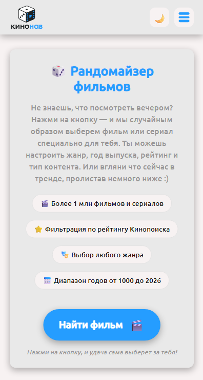
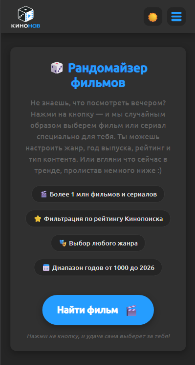
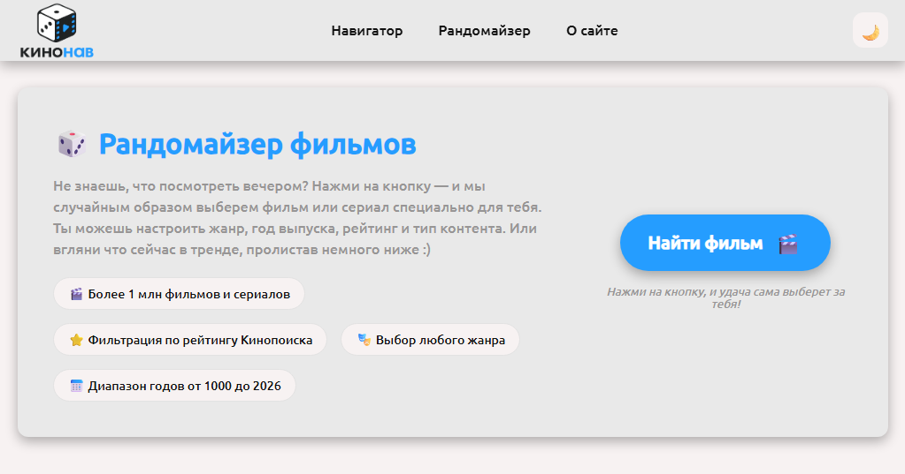
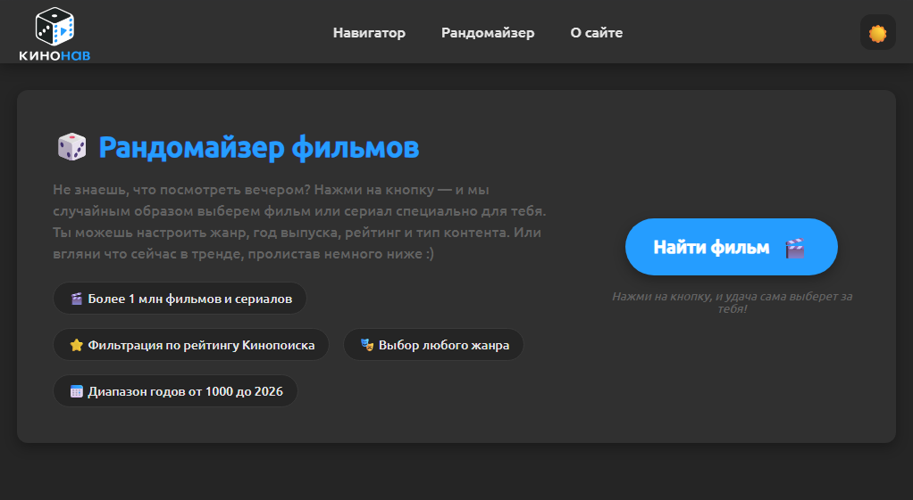

# 🎲 Кинонав  
> Твой навигатор в мире кино  

[🌐 Перейти на сайт](https://kingston256gb.github.io/kinonav)
--
## 📌 О проекте
**Кинонав** — веб-приложение, созданное для быстрого выбора фильмов, сериалов и ТВ-шоу на просмотр. Проект разработан в рамках обучения на курсах **"Программирование на JavaScript"** от проекта **["Код будущего"](https://www.gosuslugi.ru/futurecode)** провайдера **НИ ТГУ**

## 🎯 Цели проекта:
* Создать удобный сервис для выбора фильмов, сериалов и ТВ-шоу
* Использовать API Кинопоиска для выбора, поиска и отображения инормации о кино
* Адаптировать сервис для удобного пользования на любом устройстве
* Применить современные технологии разработки

## 🛠️ Технологии:
|🛠️| Технология | Описание | 
| --- | --- | --- |
| ✏️  |HTML 5.0 | Семантическая верстка |
|🎨  |CSS 3 | Переменные, смена темы, дизайн сайта, адаптив под разные устройства |
|⚡  |JavaScript | Чистый JS - быстрый отклик сайта, функционал веб сервиса|
|🌐  |Kinopoisk API | Используется уже готовая обширная база мирового кино |
|📦  |LocalStorage | Сохраненние выбранной темы и кэширование |
|📜  |Manifest | Возможность установить сайт как приложение |

## ⚡ Функционал
* 🎲 **Рандомайзер** — случайный выбор кино на основе предпочтений пользователя
* 🗺️ **Навигатор** — поиск кино по ключевым словам, ТОП-10, ТОП-100, ТОП-250
* 📜 **Страница фильма** — более подробная информация о конкретном фильме
* 🌓 **Смена темы** — тема подстраивается под систему пользователя, но так же есть возможность изменить вручную
* 📱 **Адаптив** — удобно использовать на любом устройстве
* 💾 **Кэширование** — быстрая загрузка при повторных посещениях
* 📦 **Manifest** — возможность установить сервис как PWA приложение

## 📸 Скриншоты
### 📱 Мобильная версия 
| ☀️ Светлая тема | 🌙 Темная тема |
| :---: | :---: |
| | |

### 💻 Десктопная версия
| ☀️ Светлая тема | 🌙 Темная тема |
| :---: | :---: |
| | |

---
## 💘 Благодарности
Особая благодарность преподавателям и кураторам с проекта **"Код Будущего"**, этот сайт существует именно из-за вашего обучения и подхода к обучению. Вы смогли доказать, что создание сайта не сложное, а скорее интересное и увлекательное занятие. Вы стали проводниками в интересный и увлекательный мир IT. Спасибо вам за это огромное! 💘

## 📄  Лицензия
Проект создан в образовательных целях. Все права на контент принадлежат Кинопоиску

## 📞 Контакты
*  [GitHub](https://github.com/kingston256gb)
* [Форма обратной связи](https://forms.yandex.ru/u/6a3a7fa3902902002b9d94f4)

---

© 2026 Кинонав. Все права защищены.